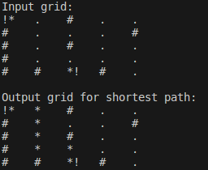

# Published tasks
This repository contains list of tasks that were required in a Robot Operating System (ROS) course.

## Depth First Search (DFS)

## Breadth First Search (BFS)
To run command
```
python3 task1_bfs.py
```
Preview:</br>


Definition:</br>
start = .*
end = *.
selected path = *
unselected path = .
obstacle = #