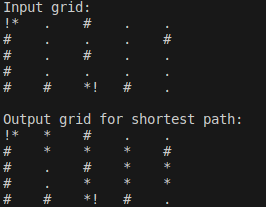

# ROS Tasks
This repository contains list of tasks that were required in a Robot Operating System (ROS) course.

## Instructions
Make sure you have python before cloning the repository.
```bash
git clone https://github.com/Bumbleboss/ros_tasks.git
```

# Tasks
## Depth First Search (DFS)
To run command
```
python3 task1_dfs.py
```

Preview:</br>


**Grid points definition:**
- Start point = !*
- End point = *!
- Traversed point = *
- Untraversed point = .
- Obstacle = #

**Functions present in the code its description:**
- `verify`: verify if cell is an open space or not
- `solve`: solve for grid to find shortest path using dfs algorithm 
- `print_grid`: prints grid with/without path argument
- `main`: run the code with provided variables

## Breadth First Search (BFS)
To run command
```
python3 task1_bfs.py
```

Preview:</br>


**Grid points definition:**
- Start point = !*
- End point = *!
- Traversed point = *
- Untraversed point = .
- Obstacle = #

**Functions present in the code its description:**
- `verify`: verify if cell is an open space or not
- `solve`: solve for grid to find shortest path using bfs algorithm 
- `print_grid`: prints grid with/without path argument
- `main`: run the code with provided variables
